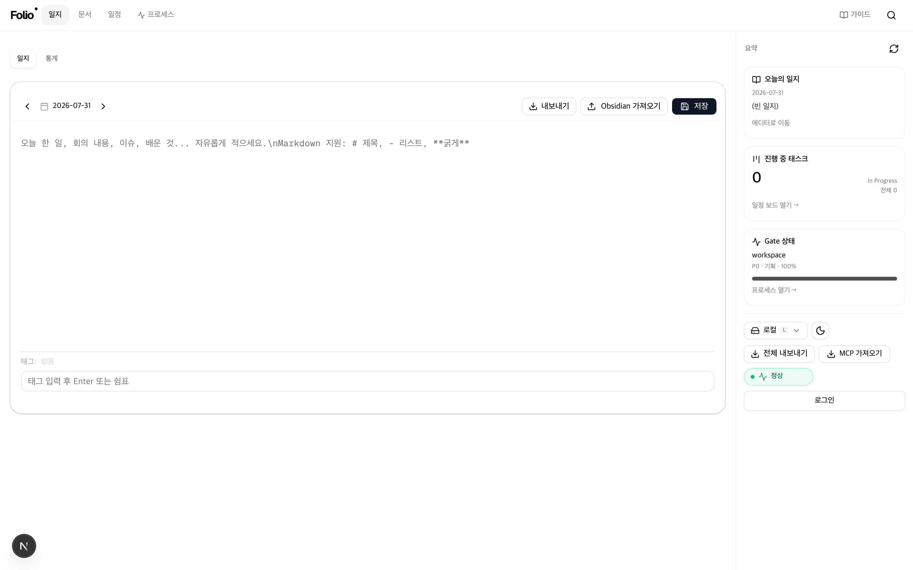
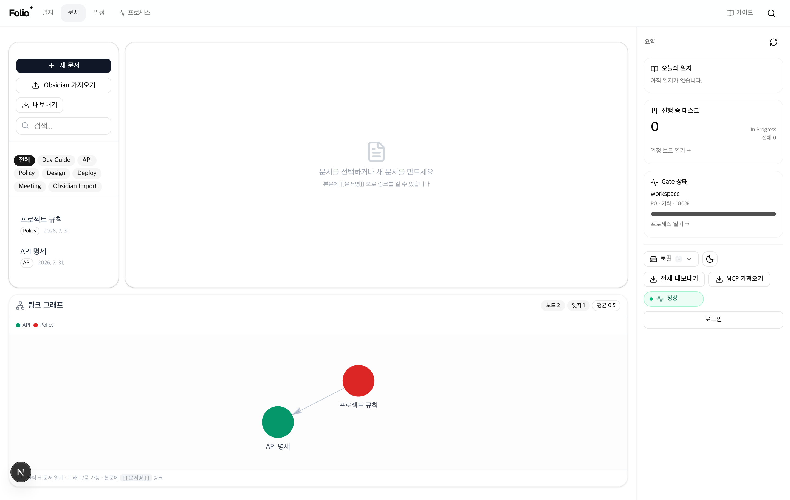
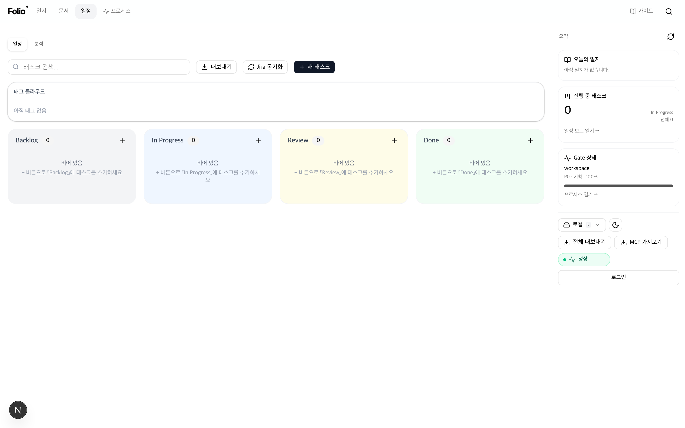
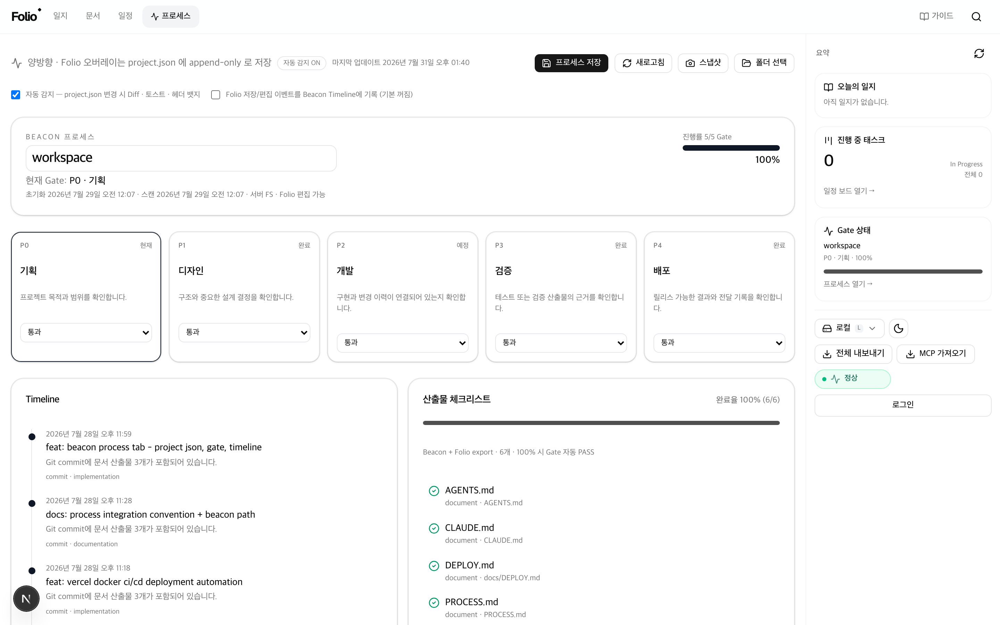
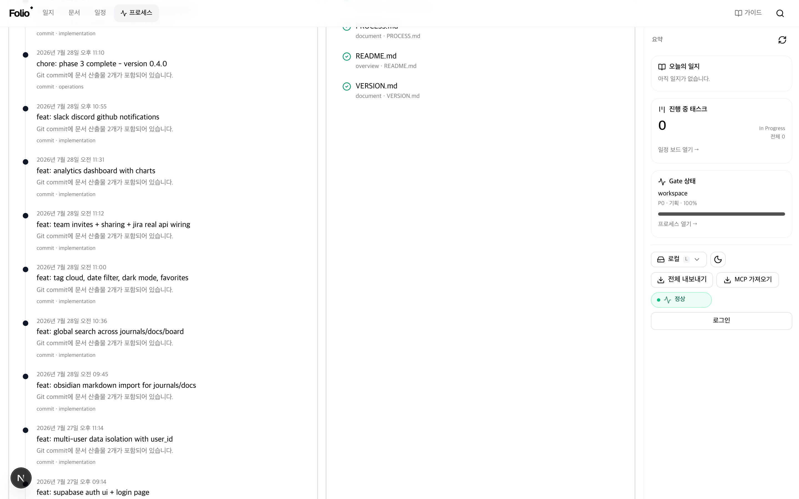
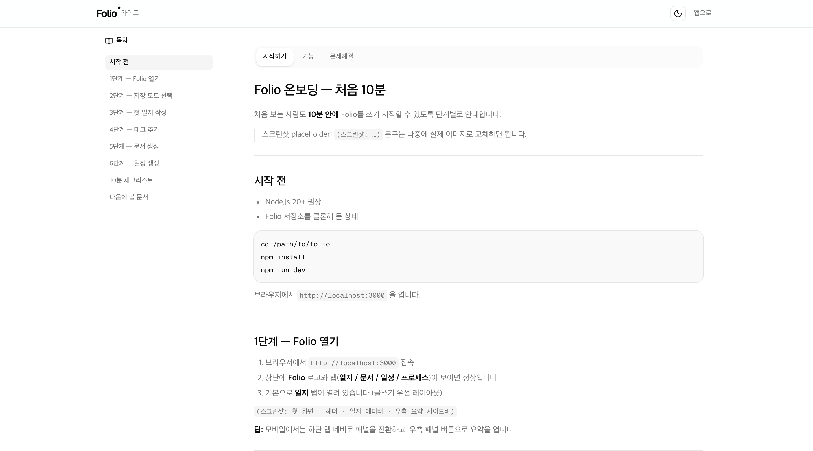
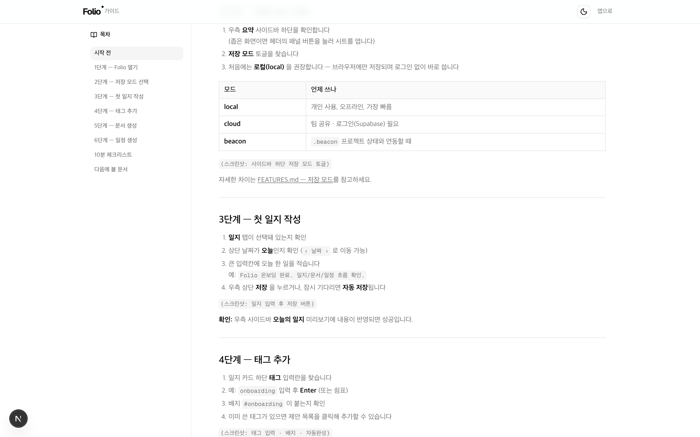

# Folio



**프로젝트의 기록, 한 곳에서.** · **v1.3.0**

Folio는 개발자의 일지·문서·일정·프로세스를 하나로 묶는 워크스페이스입니다.
Obsidian으로 메모하고, Notion으로 문서를 관리하고, Jira로 일정을 tracking하는 흐름을,
**한 화면에서**, **한 도구에서** 끝낼 수 있습니다.

---

## 왜 Folio인가?

| 도구 | 역할 |
|------|------|
| **Obsidian** | 개인 메모, 생각 정리, 지식 그래프 |
| **Notion** | 팀 공통 문서, 정책, 가이드 |
| **Jira** | 프로젝트 일정, 이슈 트래킹 |
| **Folio** | **이 셋을 하나의 워크스페이스로 통합** |

로컬 우선으로 시작해 팀 공유·Beacon·MCP까지 확장할 수 있습니다.
데이터는 브라우저 또는 Supabase/Beacon에 저장되며, Markdown/CSV/JSON/ZIP으로 내보낼 수 있습니다.

---

## 전체 기능 요약

| 영역 | 기능 |
|------|------|
| **일지** | 날짜별 기록 · 자동 저장 · 태그 자동완성 · Obsidian 가져오기 · 통계 · Writing-first 에디터 |
| **문서** | 마크다운 편집/프리뷰/분할 · 카테고리 · `[[위키링크]]` · 링크 그래프 · 역링크 |
| **일정** | 4컬럼 칸반 DnD · 우선순위/태그/즐겨찾기 · Jira · GitHub Issues |
| **프로세스** | Beacon Gate(P0–P4) · Timeline · 산출물 · 변경 감지 · 스냅샷 |
| **검색** | `Cmd/Ctrl+K` · 일지·문서·일정 통합 · 아이콘 확장 검색 |
| **저장** | local / cloud(Supabase) / beacon · 오프라인 큐 · PWA |
| **내보내기** | MD · CSV · JSON · ZIP · 탭별 ExportMenu · 전체 번들 |
| **연동** | Slack Block Kit · Discord Embeds · GitHub Issues/PR · MCP · 팀 초대/공유 |
| **배포** | Vercel Preview/Production · Docker/GHCR · Actions CI/Deploy/Rollback/Monitor |
| **레이아웃** | Writing-first · 우측 요약 사이드바(280px) · 모바일 하단 네비/시트 |

스택: **Next.js 16 · React 19 · Tailwind v4 · shadcn/ui**

---

## 화면

실제 화면(로컬 실행, `로컬` 저장 모드). Writing-first 레이아웃 + 우측 요약 사이드바.

### 일지 — 날짜별 기록 · 태그 · Obsidian 가져오기


### 문서 — 마크다운 편집/프리뷰 · `[[위키링크]]` · 링크 그래프


### 일정 — 4컬럼 칸반(Backlog/In Progress/Review/Done) · Jira 동기화


### 프로세스 — Beacon Gate(P0–P4) · Timeline · 산출물 체크 · 스냅샷



### 가이드 — 앱 안에서 바로 보는 온보딩/기능 안내(`/guide`)



---

## Phase 1~12 완료

| Phase | 버전 | 요약 | 상태 |
|-------|------|------|------|
| **1** | 0.2.0 | Board DnD · Journal 태그 · Docs 프리뷰 · Supabase · Jira | ✅ |
| **2** | — | Auth UI · 멀티유저 · Obsidian 가져오기 · 통합 검색 · 고급 UI | ✅ |
| **3** | 0.4.0 | 팀 초대/공유 · 분석(recharts) · Slack/Discord/GitHub | ✅ |
| **4** | 0.5.0 | 배포 자동화 · PROCESS 규약 · Beacon 프로세스 탭 · 저장 모드 토글 | ✅ |
| **5** | 0.6.0 | 성능 · a11y · 문서화 · QA · 배포 강화 | ✅ |
| **6** | 0.7.0 | 모니터링/알림 · Beacon 고도화 · 운영 런북 | ✅ |
| **7** | 0.8.0 | Beacon 양방향 · 자동화/알림 | ✅ |
| **8** | 0.9.0 | 모바일 · 위젯 · PWA/오프라인 | ✅ |
| **9** | 1.0.0 | 실제 배포 (Vercel/Docker · 도메인/SSL · 롤백) | ✅ |
| **10** | 1.1.0 | 링크 그래프 · 내보내기 · MCP · Writing-first 레이아웃 | ✅ |
| **11** | 1.2.0 | 가이드/매뉴얼 · AI 요약 · 고급 분석 · Slack Block Kit | ✅ |
| **12** | **1.3.0** | Discord Embeds · GitHub PR/Board · 자동 배포 파이프라인 | ✅ |

Phase 12 상세: **P39** Discord/GitHub · **P40** CI/Deploy/Docker/GHCR/Rollback  
이력: [VERSION.md](VERSION.md)

---

## 빠른 시작

```bash
git clone https://github.com/dayainow/folio.git
cd folio
npm install
npm run dev
```

브라우저에서 `http://localhost:3000` 열기.  
환경변수: [docs/env.example](docs/env.example) · 상세: [docs/GETTING-STARTED.md](docs/GETTING-STARTED.md)

품질 검사:

```bash
npm run lint && npm run typecheck && npm run qa:smoke
```

---

## MCP 가이드 — 다른 프로젝트 작업을 Folio에 쌓기

전체 매뉴얼: **[docs/MCP-GUIDE.md](docs/MCP-GUIDE.md)** · 상세 스펙: [docs/MCP.md](docs/MCP.md)

```text
다른 프로젝트 ←(MCP)→ Folio(.folio-mcp) ←(MCP 가져오기)→ Folio 화면
```

### 1) 다른 프로젝트에 연결 (1회)

```bash
cd /path/to/folio
npm run mcp:link -- /path/to/your-project --name my-app
```

설치: `.cursor/mcp.json` · `.vscode/mcp.json` · `.cursor/rules/folio-worklog.mdc` · `FOLIO-MCP.md`

### 2) Cursor에서 작업

1. 대상 프로젝트를 Cursor로 연다  
2. Settings → MCP 에서 `folio` 연결 확인  
3. Agent로 작업 → 규칙이 일지/보드에 자동 기록  
4. 필요 시 「Folio에 남겨줘」 요청

### 3) Folio 화면에 반영

```bash
cd /path/to/folio && npm run dev
```

사이드바/헤더 **「MCP 가져오기」** → 일지/문서/일정 확인

### 4) (선택) Git 푸시·CLI

```bash
npm run mcp:client -- webhook '{"message":"feat: demo","author":"you"}'
npm run mcp:client -- tools
npm run mcp:client -- call journal_read '{}'
```

GitHub Webhook: `POST /api/mcp/git-webhook` + `FOLIO_MCP_WEBHOOK_SECRET`

---

## 배포 파이프라인

상세: [docs/DEPLOY.md](docs/DEPLOY.md) · 런북: [docs/runbooks/DEPLOY.md](docs/runbooks/DEPLOY.md)  
환경변수 템플릿: [.env.production.example](.env.production.example)

| 경로 | 동작 |
|------|------|
| **Vercel Git** | PR → Preview · `main` → Production |
| **Actions `ci.yml`** | lint · typecheck · qa:smoke · build |
| **Actions `deploy.yml`** | 게이트 → Vercel Production → `/api/health` · `/api/runtime` → 실패 시 롤백 |
| **Actions `docker.yml`** | multi-stage 이미지 → **GHCR** (`ghcr.io/<owner>/folio`) |
| **Actions `rollback.yml`** | `vercel rollback` (수동 · deploy 헬스 실패 시) |
| **Actions `monitor.yml`** | 30분마다 Production 헬스 프로브 |

```bash
# 로컬 Docker
cp docs/env.example .env.local
docker compose up --build -d
curl -sS http://localhost:3000/api/health

# 배포 후 헬스 (Actions와 동일 스크립트)
FOLIO_PRODUCTION_URL=https://your-domain.com npm run deploy:health
```

GitHub Secrets (선택): `VERCEL_TOKEN` · `VERCEL_ORG_ID` · `VERCEL_PROJECT_ID` · `FOLIO_PRODUCTION_URL`

---

## Discord / GitHub 연동

환경변수: [docs/env.example](docs/env.example) · Production: [.env.production.example](.env.production.example)

### Discord Embeds

1. Discord 채널 → 연동 → 웹후크 → URL 복사
2. `DISCORD_WEBHOOK_URL` 설정 (`.env.local` / Vercel)
3. 저장 완료 · 태스크 Done · Gate 변경 시 **Rich Embed** 전송
   - 초록(완료) · 주황(경고) · 파랑(정보)
   - Footer: Folio 링크 + timestamp (`NEXT_PUBLIC_FOLIO_URL`)

### GitHub Issues / PR

1. `GITHUB_TOKEN` · `GITHUB_REPO=owner/repo` 설정
2. 일정(Board) 탭 → **GitHub 동기화** — Issue 상태·담당자·라벨 반영
3. Webhook: `POST /api/github/webhook` (Events: `pull_request`, `issues`, `workflow_run`)
   - 시크릿: `GITHUB_WEBHOOK_SECRET` (또는 `FOLIO_MCP_WEBHOOK_SECRET`)
4. PR 머지 시 연결된 Board 태스크가 **Done**으로 이동
5. (선택) Actions `folio-sync.yml` — `FOLIO_WEBHOOK_URL` / `FOLIO_WEBHOOK_SECRET`

---

## 가이드 (처음 쓰는 분)

앱 헤더 **가이드** → [`/guide`](http://localhost:3000/guide) 또는 아래 문서:

| 문서 | 내용 |
|------|------|
| **[온보딩 10분](docs/ONBOARDING.md)** | Folio 열기 → 저장 모드 → 일지 → 태그 → 문서 → 일정 |
| **[기능 상세](docs/FEATURES.md)** | 일지·문서·일정·프로세스·검색·저장·내보내기·MCP |
| **[문제 해결](docs/TROUBLESHOOTING.md)** | 저장/로그인/Beacon/PWA/데이터 복구 |

---

## 사용 가이드

| 주제 | 문서 |
|------|------|
| **내부 사용 가이드** | [docs/INTERNAL.md](docs/INTERNAL.md) |
| 설치·시작 | [docs/GETTING-STARTED.md](docs/GETTING-STARTED.md) |
| **기여 가이드** | [docs/CONTRIBUTING.md](docs/CONTRIBUTING.md) |
| **MCP 가이드** | [docs/MCP-GUIDE.md](docs/MCP-GUIDE.md) |
| MCP 레퍼런스 | [docs/MCP.md](docs/MCP.md) |
| 아키텍처 | [docs/ARCHITECTURE.md](docs/ARCHITECTURE.md) |
| 배포 | [docs/DEPLOY.md](docs/DEPLOY.md) |
| Beacon 연동 | [docs/BEACON.md](docs/BEACON.md) |
| 접근성 | [docs/A11Y.md](docs/A11Y.md) |
| API 레퍼런스 | [docs/API.md](docs/API.md) |
| 버전 이력 | [VERSION.md](VERSION.md) |

---

## 개발

```bash
npm run build
npm run lint          # --max-warnings 0
npm run typecheck
npm run qa:smoke
npm run runbook:backup
```

자세한 내용은 **[기여 가이드](docs/CONTRIBUTING.md)**를 참고하세요.

---

## 로드맵

- **v1.0** ✅ — 일지·문서·일정·검색·팀·배포
- **v1.1** ✅ — 링크 그래프·내보내기·MCP·Writing-first
- **v1.2** ✅ — 가이드/매뉴얼 · AI 요약·고급 분석·Slack 고급
- **v1.3** ✅ — Discord Embeds · GitHub PR/Board · 자동 배포 파이프라인
- **v2.0** — 모바일 네이티브·실시간 협업

## 작업 관리

- 현재 Phase: **Phase 12 완료** (v**1.3.0** 정식)
- 진행 중: —
- 완료: Phase 1~12 (1.3.0) · P39 Discord/GitHub · P40 배포 파이프라인
- 다음: v2.0 모바일 네이티브 / 실시간 협업
- 이어가기: `git pull origin main` 후 이 상태에서 진행 ([VERSION.md](VERSION.md))

---

## 라이선스

Copyright (c) dayainow. All rights reserved.

본 저장소는 private 프로젝트입니다. 사전 허가 없이 복제·재배포·상업적 이용을 할 수 없습니다.
기여 시 [docs/CONTRIBUTING.md](docs/CONTRIBUTING.md)를 따라 주세요.

---

**Folio** — 프로젝트의 기록, 한 곳에서. · v1.3.0
