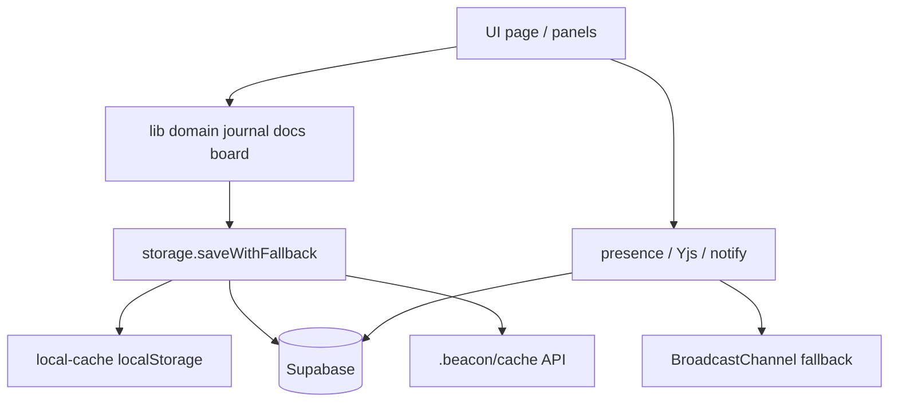

# Folio 아키텍처 (Architecture) — v2.0

## 개요

Folio는 Next.js App Router 클라이언트 중심 워크스페이스입니다. 데이터는 **저장 모드**에 따라 `localStorage` · Supabase · `.beacon/cache`에 기록되며, 원격 실패 시에도 **로컬 선행 저장**으로 UX를 보장합니다.

v2.0(P46→정식)은 1.x 기능을 유지한 채 **테스트·보안 헤더·문서·CI**를 기준선으로 고정합니다. `*WithFallback` 이중 경로는 의도된 오프라인·장애 대응입니다.

## 아키텍처 다이어그램



```
UI (page / panels)
    ↓
lib/*WithFallback (journal · docs · board)
    ↓
storage.saveWithFallback / loadWithFallback
    ├── local  → local-cache (debounce + flush)
    ├── cloud  → Supabase (user_id) + 로컬 미러
    └── beacon → /api/beacon/folio → .beacon/cache/folio-*.json

협업 계층 (P41–P45)
    ├── presence / collab-yjs (Realtime 또는 BroadcastChannel)
    ├── comments · activity-stream · notification-center
    └── team · resource-acl · invite-link
```

## 폴더 구조

```
src/
  app/                 # App Router (page, login, api/*, guide)
  components/          # 패널 · UI · 검색 · 팀 · 협업
  hooks/               # Presence · viewport · swipe
  lib/                 # 도메인 · 저장 · 연동 · 협업 · sanitize/env
  mcp/                 # MCP 서버
docs/                  # 사용자·운영·마이그레이션·테스트
scripts/               # QA · 번들 · MCP
vitest.config.ts       # 단위 테스트
```

## 데이터 흐름

1. 패널이 `load*WithFallback()` 으로 초기 로드
2. 편집 시 낙관적 UI 갱신
3. `save*WithFallback()` → **항상 로컬 먼저** → cloud/beacon (타임아웃 시 `usedFallback`)

### Auth · 멀티유저

- `createBrowserSupabaseClient` / 서버 클라이언트
- 로그인 시 `migrateLocalDataOnLogin()`
- RLS: `docs/supabase-schema*.sql`

## 저장 모드 비교

| 모드 | 읽기 | 쓰기 | 실패 시 | 전제 |
|------|------|------|---------|------|
| `local` | localStorage | localStorage | — | 기본 |
| `cloud` | Supabase → local | 로컬 선행 + Supabase | local 유지 | Auth + env |
| `beacon` | cache → local | 로컬 선행 + cache JSON | local 유지 | `.beacon` / 자가호스팅 |

모드 키: `localStorage['folio_storage_mode']`

## 보안 (v2.0)

- CSP · nosniff · Referrer-Policy · Frame-Options · Permissions-Policy (`next.config.ts` headers)
- `src/lib/sanitize.ts` — HTML/URL/메시지 이스케이프
- 시크릿은 서버 env만 (`JIRA_*`, webhook, VAPID private)

## 테스트 · 성능

- [TESTING.md](./TESTING.md) · [PERFORMANCE.md](./PERFORMANCE.md)
- CI: lint · typecheck · test · qa:smoke · build

## Beacon 경계

Folio는 CLI 원본(`project.json` / `beacon.db`)을 쓰지 않고 `.beacon/cache/folio-*.json`만 사용합니다.  
상세: [BEACON.md](./BEACON.md) · [PROCESS.md](../PROCESS.md)
